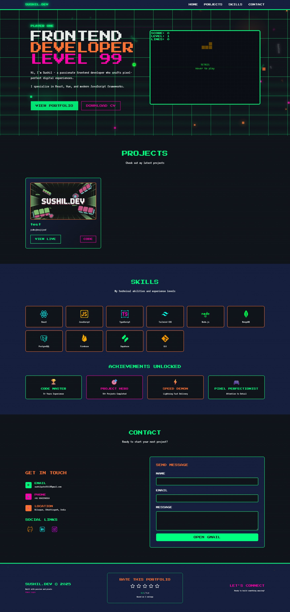
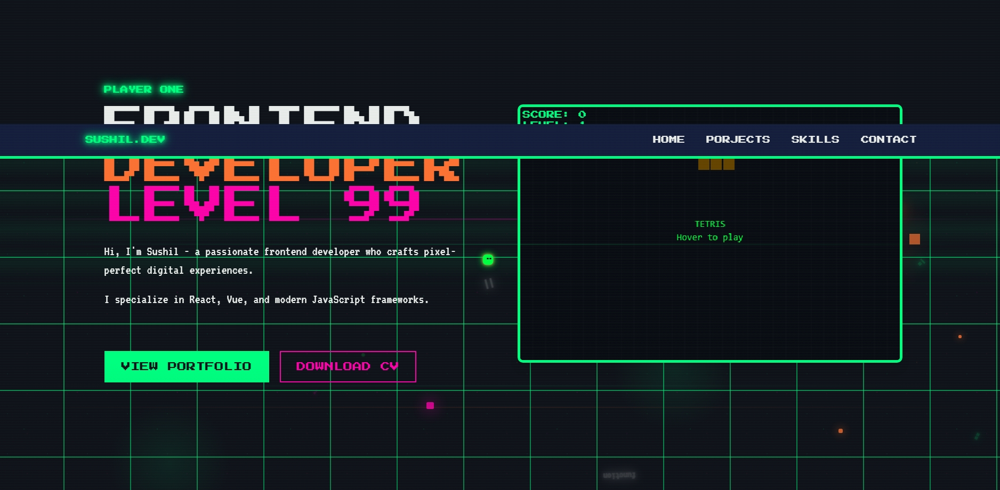
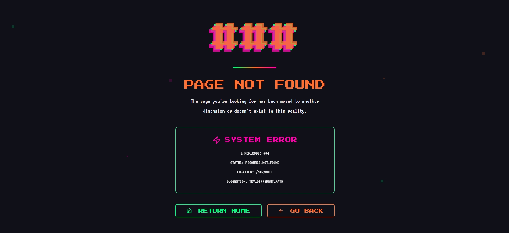
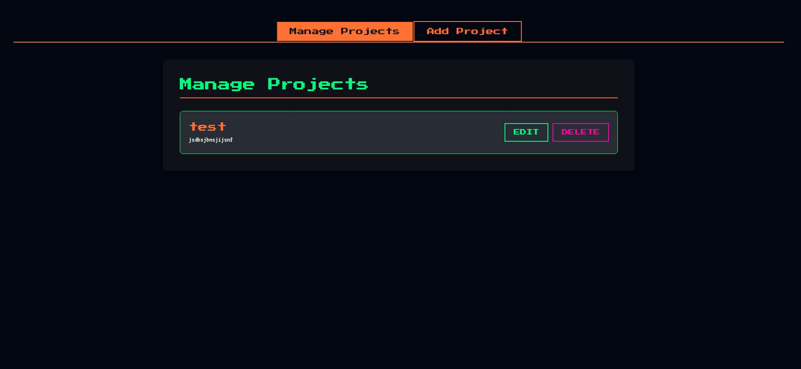
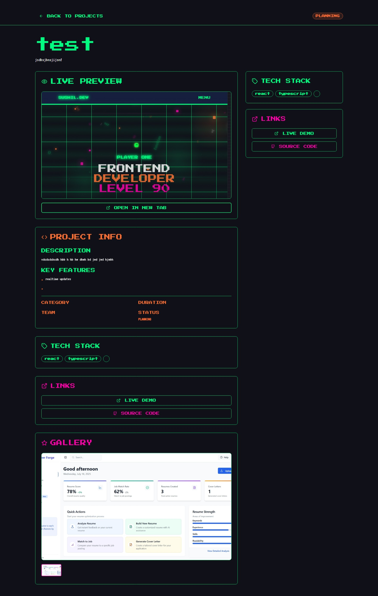
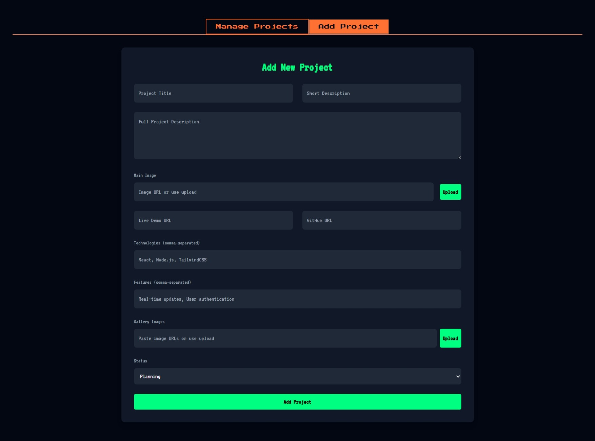

# My Portfolio


A full-stack personal portfolio website built with React, TypeScript, and Express, showcasing my projects, skills, and a bit of my personality.

[](https://sushil-dev-wzc6.onrender.com)

## 🚀 Features

- **Dynamic Project Showcase**: Fetches project data from a Firebase backend.
- **Interactive Tetris Game**: A playable Tetris game on the hero section.
- **Admin Panel**: A secure area to manage projects.
- **Contact Form**: Integrated email functionality for inquiries.
- **Responsive Design**: Looks great on all devices.

## 🛠️ Tech Stack

### Frontend
- **React**: A JavaScript library for building user interfaces.
- **TypeScript**: Typed superset of JavaScript.
- **Tailwind CSS**: A utility-first CSS framework.
- **React Query**: For data fetching and state management.
- **Lucide-react**: For icons.

### Backend
- **Express.js**: A fast, unopinionated, minimalist web framework for Node.js.
- **Firebase**: Used as the database for storing project information.
- **Node.js**: JavaScript runtime environment.

## Project Structure
```
sushil.dev/
├── client/         # React frontend
│   ├── public/
│   ├── src/
│   │   ├── components/
│   │   ├── pages/
│   │   └── ...
│   └── ...
├── server/         # Express backend
│   ├── dist/
│   ├── src/
│   │   ├── routes.ts
│   │   ├── storage.ts
│   │   └── server.ts
│   └── ...
└── README.md
```

## ⚙️ Getting Started

### Prerequisites

- Node.js (v18 or later)
- npm or yarn

### Installation

1.  **Clone the repository:**
    ```bash
    git clone https://github.com/your-username/your-repo-name.git
    cd your-repo-name
    ```

2.  **Install frontend dependencies:**
    ```bash
    cd client
    npm install
    ```

3.  **Install backend dependencies:**
    ```bash
    cd ../server
    npm install
    ```

### Environment Variables

The backend requires a `.env` file in the `server` directory with the following variables:

```
ADMIN_PASSWORD=your_secure_admin_password
SESSION_SECRET=your_long_random_session_secret
FIREBASE_SERVICE_ACCOUNT_KEY=your_base64_encoded_firebase_service_account_key
```

- `ADMIN_PASSWORD`: Password to access the admin panel.
- `SESSION_SECRET`: A secret key for signing the session ID cookie.
- `FIREBASE_SERVICE_ACCOUNT_KEY`: Your Firebase service account key, base64 encoded.

### Running the Application

1.  **Start the backend server:**
    ```bash
    cd server
    npm run dev
    ```
    The backend will be running on `http://localhost:3001`.

2.  **Start the frontend development server:**
    ```bash
    cd client
    npm run dev
    ```
    The frontend will be running on `http://localhost:5173`.

## 🖼️ Gallery

<table align="center">
  <tr>
    <td align="center"></td>
    <td align="center"></td>
    <td align="center"></td>
  </tr>
  <tr>
    <td align="center"></td>
    <td align="center"></td>
    <td align="center"></td>
  </tr>
</table>

## 📜 License

This project is licensed under the MIT License - see the [LICENSE](LICENSE) file for details.
